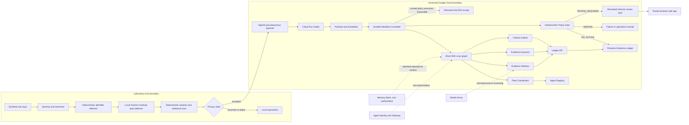

# Recall Target Architecture

- Status: accepted design baseline
- Updated: 2026-08-16
- Related ADRs: `ADR-0001` through `ADR-0007`

## Product boundary

Recall is a clinician-review prioritization and evidence-audit system. It does not autonomously classify a result, edit a clinical report, or contact a patient.

The hackathon deployment is specifically a non-clinical research prototype. It uses synthetic institutional records and source-attributed public evidence. The laboratory integration is a future target architecture, not a claim that the current Gemini and Google Cloud path is authorized for clinical production. De-identification does not alter this purpose boundary. See `ADR-0006`.

Any `ReviewTask` shown in the contest build is a simulated workflow artifact tied to a synthetic watch case. It is never routed into a real laboratory queue or used for patient care.

The competition architecture must make five properties visible and testable:

1. institutional watch cases persist across weeks without a continuously running model process;
2. each scan is short, idempotent, bounded, and independently auditable;
3. managed agent discovery, identity, memory, and security controls have explicit roles;
4. model output and model memory remain non-authoritative;
5. every demo state is derived from the same typed artifacts used by policy and evaluation.

## Trust zones

### Laboratory boundary

- raw lab input;
- direct and operational identifiers;
- local token mapping;
- deterministic minimization and identifier detection;
- local Gemma residual-span detection;
- deterministic redaction and outbound scanning;
- quarantine and signed PrivacyReceipt.

Raw identity, raw free text, redacted values, and token mappings do not leave this boundary.

### Governed cloud boundary

- minimized pseudonymous watch cases;
- public-source evidence;
- typed agent artifacts;
- workflow state, audit receipts, and review tasks;
- sanitized telemetry.

## Authority hierarchy

1. Local Privacy Gate decides whether a payload may leave the laboratory.
2. Firestore Evidence Ledger is authoritative for workflow and evidence state.
3. Deterministic Workflow Controller owns transitions, leases, budgets, retries, agent invocation, and recovery.
4. Deterministic Policy Gate is the only component that emits semantic terminal workflow outcomes.
5. Clinician is the only authority that accepts, rejects, or acts on a review task.
6. Agents, ADK sessions, Memory Bank, model output, and observability data are non-authoritative.

## Logical flow



The diagram shows the target managed path. Phase 1 smoke tests must confirm each managed component before it becomes a hard implementation dependency.

## Agent responsibilities

| Role | Allowed | Forbidden |
|---|---|---|
| Fleet Coordinator | Query approved Registry metadata and propose a typed bounded route | Search evidence, interpret clinical meaning, write state, invoke arbitrary endpoints, or decide outcome |
| Evidence Watcher | Use allowlisted evidence connectors and create observations/snapshots | Assign clinical criteria, suppress counter-evidence, notify, or follow arbitrary URLs |
| Evidence Assessor | Compare snapshots and propose an evidence delta with uncertainty and counter-evidence | Access identity, invent citations, classify, or request clinician review |
| Citation Auditor | Independently refetch metadata and verify every material claim/source relationship | Treat assessor prose as proof, change policy, or create a review task |

The deterministic Controller, not the Coordinator, invokes the Registry-resolved resource and records the selected version.

Each role receives a separate service identity, tool allowlist, input/output schema, model and token budget, deadline, and forbidden-action test. The Coordinator may discover and propose. It may not invoke the selected resource directly.

## Managed platform control plane

| Component | Required Recall role | Authority boundary | Required proof |
|---|---|---|---|
| Agent Runtime | Host separately versioned ADK agent revisions | Runtime availability does not grant workflow authority | Deployed revision and successful typed invocation |
| Agent Registry | Catalog agents, endpoints, MCP servers, and skills; support capability discovery and explicit bindings | Registry metadata is validated by the Controller before invocation | Catalog read-back and `RegistryResolutionReceipt` |
| Agent Identity | Give each role least-privilege credentials | Agents cannot mint or expand their own permissions | IAM inventory and denied-action test |
| Agent Gateway | Centralize approved tool routing and policy enforcement where available | Gateway failure cannot silently widen access | Allowed and denied tool-call receipts |
| Memory Bank | Carry admitted operational context across scans | It is never clinical evidence or workflow state | Admission, retrieval, expiry, and poisoning-rejection receipts |
| Model Armor | Screen untrusted external content and tool responses | It is not the lab PHI anonymizer and not a policy authority | Benign pass, injection block, and service-unavailable behavior |
| Observability | Correlate run, artifact, tool, model, and policy events | No raw PHI, raw clinical free text, token map, or chain-of-thought | Sanitized trace and field audit |

Remote A2A is optional and preview-gated. Registry-resolved Controller invocation is the mandatory fallback. Managed component outages must produce a typed degraded or abstention result, never an unrecorded bypass.

## Required contracts

- `PrivacyReceipt`
- `WatchCase`
- `ScanRun`
- `ScanRunEvent`
- `RoutingPlan`
- `RegistryResolutionReceipt`
- `ToolAuthorizationReceipt`
- `EvidenceObservation`
- `EvidenceSnapshot`
- `EvidenceDelta`
- `AssessmentReceipt`
- `CitationAuditReceipt`
- `MemoryAdmissionReceipt`
- `MemoryRetrievalReceipt`
- `DataModeReceipt`
- `PolicyDecision`
- `ReviewTask`
- `HumanDecisionReceipt`
- `FailureReceipt`
- `DeploymentReceipt`
- `ManagedPathReceipt`
- `HistoricalReplayEvaluation`
- `UtilityEvaluation`
- `PrivacyEvaluation`

All contracts are versioned, reject unknown fields, and contain the common provenance envelope defined in `docs/contracts/ARTIFACT_CONTRACTS.md`. Contract paths and UI paths are changed together.

## Durable lifecycle decomposition

### WatchCase lifecycle

`WatchCase` is the weeks-long institutional object. It contains the monitoring policy, `next_scan_at`, source cursors, last verified snapshot reference, tenant, region, retention policy, and any open review-task reference.

```text
ACTIVE <-> PAUSED
ACTIVE -> AWAITING_HUMAN
AWAITING_HUMAN -> ACTIVE | CLOSED
PAUSED -> CLOSED
```

No model process remains running between scans. Scheduler or an approved event creates a new `ScanRun` for an eligible `WatchCase`.

### ScanRun lifecycle

Each cloud `ScanRun` is created only after a valid accepted `PrivacyReceipt`. Privacy quarantine remains inside the laboratory and creates no cloud run. Each run is a short, independently replayable unit targeted to complete below the upstream trigger timeout.

```text
CREATED -> QUEUED -> ROUTING -> WATCHING
WATCHING -> POLICY_EVALUATION                         (complete no-change snapshot)
WATCHING -> ASSESSING -> AUDITING -> POLICY_EVALUATION  (candidate change)
POLICY_EVALUATION -> NO_ACTION | ABSTAIN | REVIEW_REQUIRED
Any nonterminal state -> HALTED                       (trusted policy execution or ledger integrity impossible)
```

`NO_CHANGE_FOUND` is an evidence fact, not a state. It still enters `POLICY_EVALUATION` so only Policy Gate can emit `NO_ACTION`. `HALTED` is a technical Controller terminal, not a policy outcome, and never creates a task. See `ADR-0007` and `docs/contracts/LIFECYCLE_STATE_MACHINES.md`.

### ReviewTask lifecycle

```text
OPEN -> ACKNOWLEDGED -> DISMISSED | ESCALATED | CLOSED
```

No agent writes authoritative lifecycle state. Transitions are append-only, compare-and-set protected, idempotency-keyed, and linked to the exact input and output artifact hashes.

## State and memory boundary

Firestore stores authoritative case state, scan state, source snapshots, evidence deltas, policy decisions, review tasks, and failure receipts.

ADK sessions may store current-run interaction state for debugging and replay. Memory Bank may store only admitted operational context such as prior search-strategy summaries, connector operating hints, or previously failed non-clinical search patterns.

A deterministic `MemoryAdmissionGate` enforces:

- tenant, case, agent, and region scope;
- allowed memory topics;
- source provenance and content hash;
- expiry and retention;
- contradiction checks against authoritative ledger facts;
- explicit rejection of proposed classifications, policy outcomes, patient identity, and unsupported evidence claims.

Memory retrieval always creates a receipt. A retrieved memory can influence an agent proposal but cannot satisfy evidence completeness, citation verification, policy, or state-transition requirements.

## Data modes

Every connector result, artifact, API response, UI view, screenshot, and metric must carry one of these modes:

| Mode | Meaning | Permitted claim |
|---|---|---|
| `SYNTHETIC` | Generated institutional case or fault fixture | Product behavior only, not real-world performance |
| `CAPTURED_REPLAY` | Frozen, source-attributed public evidence replay | Reproducible historical behavior within the frozen case |
| `LIVE_PUBLIC` | Current query to an approved public source | Current connector behavior at the recorded time |
| `MOCK` | Interface substitute used only in tests | No production or live-data claim |

Real patient data is prohibited. The target demo combines synthetic institutional watch records with source-attributed public evidence. No synthetic dataset is described as production data.

## Hard execution limits

- delegation depth: 1;
- specialist agents per run: maximum 3;
- one normal model call per role;
- one schema-repair attempt per agent;
- one agent retry for transient runtime failure;
- three bounded connector retries;
- repeated state hash terminates as `loop_detected`;
- explicit step deadlines, token ceilings, and end-to-end budget.
- per-run lease expiry and crash-safe resume from authoritative state;
- inbox/outbox idempotency and dead-letter handling;
- no trigger execution designed to exceed ten minutes.

## Fail-closed behavior

| Failure | Required result |
|---|---|
| Privacy uncertainty or invalid local model output | Quarantine; no cloud payload and no cloud `ScanRun` |
| Invalid or forbidden route | Reject, one repair, deterministic fallback, then `ABSTAIN` |
| Source unavailable or schema drift | `ABSTAIN` plus operations receipt |
| Invalid agent artifact | One repair, then `ABSTAIN` |
| Fabricated or mismatched citation | Remove/flag; continue only if all remaining material claims verify |
| Omitted counter-evidence or incomplete audit | `ABSTAIN`; no clinician task |
| Worker loop or budget exhaustion | `ABSTAIN`; no clinician task |
| Duplicate delivery | Existing run returned; no duplicate task |
| Notification failure | Outbox retry without repeating policy evaluation |
| Registry unavailable or selected revision fails validation | Use only a pre-approved pinned fallback when policy permits; otherwise `ABSTAIN` |
| Memory poisoning, stale memory, or authority conflict | Reject memory, record receipt, continue from Firestore or `ABSTAIN` if required context is unavailable |
| Model Armor unavailable | Do not silently pass untrusted free text; use a preregistered local deterministic restriction or `ABSTAIN` |
| Identity or Gateway denial | Record denial; no alternate credential or endpoint escalation |
| Policy Gate unavailable or ledger integrity failure | Technical `HALTED`; zero fabricated PolicyDecision and zero task |

## Web product surfaces

- workload-first landing page;
- synthetic case intake and privacy receipt;
- run timeline and authoritative state transitions;
- previous/current evidence comparison;
- claim-level citation audit;
- denied route or tool action;
- policy outcome and reason codes;
- clinician review task;
- architecture/catalog view with agent versions and scopes;
- weeks-long `WatchCase` timeline with separate short `ScanRun` records;
- memory admission/rejection and retrieval receipts;
- managed control-plane health and degraded-state evidence;
- explicit `SYNTHETIC`, `CAPTURED_REPLAY`, `LIVE_PUBLIC`, or `MOCK` labels;
- demo evidence and metric view generated from committed artifacts.

Every result-bearing field must declare its source artifact and JSON path in the derived-value registry created under RCL-208.

## Deployment

- Local: Privacy Gateway and Gemma through `llama.cpp`.
- Google Cloud critical path for the non-clinical contest prototype: Vertex AI Gemini, ADK, Agent Runtime, Agent Registry, Cloud Run, Pub/Sub, Firestore, Scheduler, Secret Manager, and sanitized observability.
- Google Cloud governed extensions, subject to Phase 1 access gates: Memory Bank, Agent Identity, Agent Gateway, and Model Armor.
- Hetzner: public web application and approved API edge behind HTTPS and rollback-capable deployment.
- DNS hostname: pending owner confirmation.

The public web application may run on Hetzner, but the video and evidence ledger must prove that the managed Google Cloud critical path executed. Service unavailability, preview limits, region constraints, and fallback use must be disclosed in the run receipt.

No contest deployment, demo, or public claim may describe the Gemini path as clinically deployed, clinically validated, or approved for patient care. Future laboratory production use is blocked until a separate provider-terms, regulatory, privacy, security, validation, and institutional-approval gate passes.

## Architecture acceptance criteria

The design gate passes only when:

1. all three lifecycle state tables and invariants are frozen before implementation in `docs/contracts/LIFECYCLE_STATE_MACHINES.md`;
2. every agent and managed component has an allowed, forbidden, timeout, and unavailable behavior;
3. Firestore, ADK Sessions, and Memory Bank have non-overlapping authority contracts;
4. a poisoned-memory fixture and a source-injection fixture have expected fail-closed outcomes;
5. Registry discovery resolves an exact version and the Controller validates it before invocation;
6. the demo storyboard includes one safe success, one no-change run, and at least two visibly blocked failure paths;
7. every planned UI result has an artifact and JSON-path lineage;
8. all claims remain `unverified` until implementation artifacts prove the mechanism ran;
9. deployment and demo copy enforce the non-clinical research boundary in ADR-0006;
10. the Phase 2 package passes the planned GitHub auditor review before Phase 3 implementation begins.
