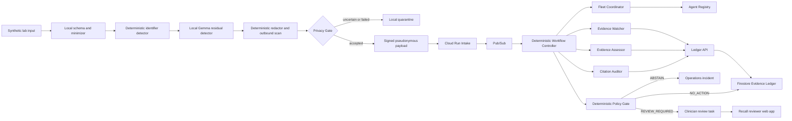

# Recall Target Architecture

## Product boundary

Recall is a clinician-review prioritization and evidence-audit system. It does not autonomously classify a result, edit a clinical report, or contact a patient.

## Trust zones

### Laboratory boundary

- raw lab input;
- direct and operational identifiers;
- local token mapping;
- deterministic minimization and identifier detection;
- local Gemma residual-span detection;
- deterministic redaction and outbound scanning;
- quarantine and signed PrivacyReceipt.

Raw identity, raw free text, redacted values, and token mappings do not leave this boundary.

### Governed cloud boundary

- minimized pseudonymous watch cases;
- public-source evidence;
- typed agent artifacts;
- workflow state, audit receipts, and review tasks;
- sanitized telemetry.

## Authority hierarchy

1. Local Privacy Gate decides whether a payload may leave the laboratory.
2. Firestore Evidence Ledger is authoritative for workflow and evidence state.
3. Deterministic Policy Gate is the only component that emits terminal workflow outcomes.
4. Clinician is the only authority that accepts, rejects, or acts on a review task.
5. Agents and model memory are non-authoritative.

## Logical flow



## Agent responsibilities

| Role | Allowed | Forbidden |
|---|---|---|
| Fleet Coordinator | Query approved Registry metadata and propose a typed bounded route | Search evidence, interpret clinical meaning, write state, invoke arbitrary endpoints, or decide outcome |
| Evidence Watcher | Use allowlisted evidence connectors and create observations/snapshots | Assign clinical criteria, suppress counter-evidence, notify, or follow arbitrary URLs |
| Evidence Assessor | Compare snapshots and propose an evidence delta with uncertainty and counter-evidence | Access identity, invent citations, classify, or request clinician review |
| Citation Auditor | Independently refetch metadata and verify every material claim/source relationship | Treat assessor prose as proof, change policy, or create a review task |

The deterministic Controller, not the Coordinator, invokes the Registry-resolved resource and records the selected version.

## Required contracts

- `PrivacyReceipt`
- `WatchCase`
- `RoutingPlan`
- `EvidenceObservation`
- `EvidenceSnapshot`
- `EvidenceDelta`
- `AssessmentReceipt`
- `CitationAuditReceipt`
- `PolicyDecision`
- `ReviewTask`
- `HumanDecisionReceipt`
- `FailureReceipt`

All contracts are versioned, reject unknown fields, and contain an artifact envelope with run ID, producer/version, input artifact IDs, creation time, content hash, status, and warnings.

## State machine

```text
RECEIVED
  -> PRIVACY_ACCEPTED | QUARANTINED
  -> SCAN_QUEUED
  -> ROUTING
  -> WATCHING
  -> NO_CHANGE_FOUND | ASSESSING
  -> AUDITING
  -> POLICY_EVALUATION
  -> NO_ACTION | ABSTAIN | REVIEW_REQUIRED
  -> CLINICIAN_TASK_CREATED
```

No agent writes a terminal state. Transitions are append-only and compare-and-set protected.

## Hard execution limits

- delegation depth: 1;
- specialist agents per run: maximum 3;
- one normal model call per role;
- one schema-repair attempt per agent;
- one agent retry for transient runtime failure;
- three bounded connector retries;
- repeated state hash terminates as `loop_detected`;
- explicit step deadlines, token ceilings, and end-to-end budget.

## Fail-closed behavior

| Failure | Required result |
|---|---|
| Privacy uncertainty or invalid local model output | Quarantine; no cloud payload |
| Invalid or forbidden route | Reject, one repair, deterministic fallback, then `ABSTAIN` |
| Source unavailable or schema drift | `ABSTAIN` plus operations receipt |
| Invalid agent artifact | One repair, then `ABSTAIN` |
| Fabricated or mismatched citation | Remove/flag; continue only if all remaining material claims verify |
| Omitted counter-evidence or incomplete audit | `ABSTAIN`; no clinician task |
| Worker loop or budget exhaustion | `ABSTAIN`; no clinician task |
| Duplicate delivery | Existing run returned; no duplicate task |
| Notification failure | Outbox retry without repeating policy evaluation |

## Web product surfaces

- workload-first landing page;
- synthetic case intake and privacy receipt;
- run timeline and authoritative state transitions;
- previous/current evidence comparison;
- claim-level citation audit;
- denied route or tool action;
- policy outcome and reason codes;
- clinician review task;
- architecture/catalog view with agent versions and scopes;
- demo evidence and metric view generated from committed artifacts.

Every result-bearing field must declare its source artifact and JSON path in the derived-value registry created under RCL-208.

## Deployment

- Local: Privacy Gateway and Gemma through `llama.cpp`.
- Google Cloud: Vertex AI Gemini, ADK, Agent Runtime, Agent Registry, Cloud Run, Pub/Sub, Firestore, Scheduler, Secret Manager, and sanitized observability.
- Hetzner: public web application and approved API edge behind HTTPS and rollback-capable deployment.
- DNS hostname: pending owner confirmation.

Remote A2A is optional and preview-gated. Registry-resolved Controller invocation is the required fallback.
