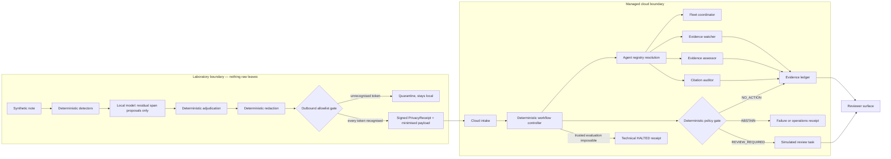

# Demo Architecture Diagram Draft

- Status: draft for the video and the architecture panel; **no component is deployed yet**
- Date: 2026-08-22
- Lane: L3 (drawing), lane L1 (platform reality), lane L2 (product code)
- Related: `docs/architecture/TARGET_ARCHITECTURE.md`, `docs/adr/ADR-0003`, `docs/adr/ADR-0004`

The target architecture document draws the full intended system. This draft is
narrower on purpose: the video may only show boxes that will actually run during
the recording. Every box below therefore carries a deployment status, and a box
that is still `NOT DEPLOYED` on recording day is removed from the frame rather
than narrated as if it existed.

## Boxes allowed in the demo frame

| Box | Where it runs | Owner lane | Deployment status on 2026-08-22 |
|---|---|---|---|
| Synthetic note intake | Laboratory | L3 | Implemented locally, not deployed |
| Deterministic detectors | Laboratory | L3 | Implemented, tested |
| Local model residual proposer | Laboratory | L3 | Adapter implemented; no runtime or model file installed |
| Deterministic adjudication, redaction, outbound gate | Laboratory | L3 | Implemented, tested |
| Signed PrivacyReceipt | Laboratory | L3 | Implemented, tested |
| Cloud intake | Managed cloud | L1 and L2 | NOT DEPLOYED |
| Message queue and scheduler | Managed cloud | L1 | NOT DEPLOYED |
| Deterministic workflow controller | Managed cloud | L2 | NOT IMPLEMENTED |
| Agent registry resolution | Managed cloud | L1 | NOT DEPLOYED |
| Four agent revisions on the agent runtime | Managed cloud | L1 and L2 | NOT DEPLOYED |
| Evidence ledger | Managed cloud | L1 and L2 | NOT DEPLOYED |
| Deterministic policy gate | Managed cloud | L2 | NOT IMPLEMENTED |
| Simulated review task and reviewer surface | Hetzner | L3 | Surface implemented against static bundles |

## Draft diagram

## Rules for the drawn version

1. A box appears only when its deployment status is verified on recording day.
2. Arrows show authority, not enthusiasm: the four agents write through the
   ledger interface and never to a terminal state.
3. The local model box is drawn with a proposal arrow only. If protocol P1 shows
   no incremental contribution, the box is removed together with the segment.
4. `ABSTAIN` and technical `HALTED` are drawn as separate terminals, because they
   are separate states with separate recovery behaviour.
5. No project identifier, account name, region-specific resource name, or
   credential appears in the drawn version.
6. The laboratory boundary is drawn as a container, never as a dotted hint: the
   claim is that raw text cannot leave, not that it usually does not.
