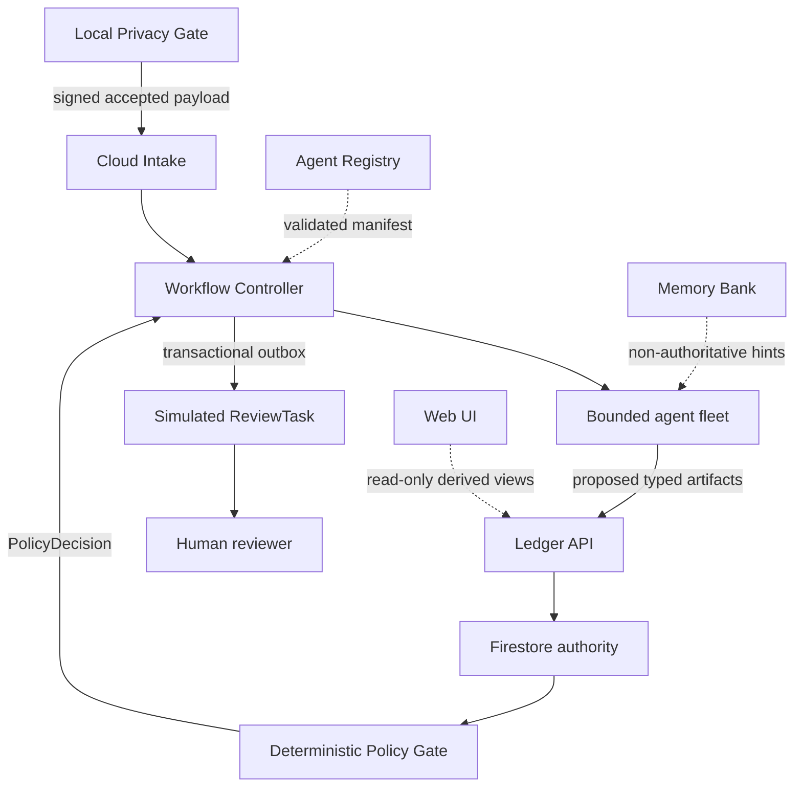

# Recall Threat Model

- Status: frozen design baseline
- Date: 2026-08-16
- Scope: non-clinical hackathon deployment and future laboratory boundary
- Related tasks: RCL-201, RCL-209, RCL-210

## Security objective

Recall must make unsafe authority expansion structurally impossible on the supported path. A model response, remembered statement, tool result, UI value, or agent route cannot by itself change authoritative state, create a `ReviewTask`, or authorize data egress.

The contest build uses synthetic institutional records and source-attributed public evidence only. It is not a clinical system. Future laboratory use requires a separate contractual, regulatory, privacy, security, and validation gate.

## Protected assets

| Asset | Required property | Authoritative owner |
|---|---|---|
| Raw laboratory input and token map | Local-only confidentiality and unlinkability | Laboratory Privacy Gateway |
| Pseudonymous watch-case payload | Minimization, signed provenance, explicit data mode | Privacy Gate and Intake |
| Workflow and evidence ledger | Integrity, append-only history, compare-and-set transitions | Firestore through Ledger API |
| Agent and tool manifests | Exact version, binding, region, and digest | Registry plus Controller validation |
| Public-source evidence | Source attribution, content hash, retrieval time, completeness status | Evidence connectors and Ledger |
| Policy outcomes and review tasks | Deterministic reproducibility and single creation | Policy Gate and Controller outbox |
| Operational memory | Scope, provenance, TTL, contradiction control | MemoryAdmissionGate |
| Demo and evaluation values | Artifact lineage and honest mode labels | Derived-value renderer |
| Credentials and service identities | Least privilege and non-exportability | Cloud IAM and Secret Manager |
| Telemetry | Correlation without sensitive content or chain-of-thought | Sanitized observability pipeline |

## Actors and trust zones

| Actor or zone | Trust assumption | Boundary control |
|---|---|---|
| Laboratory operator | Authorized to submit a supported record, not to bypass privacy checks | Local schema, minimizer, quarantine, signed receipt |
| Public demo visitor | Untrusted and potentially abusive | Rate limit, synthetic-only input, no privileged tools |
| Public evidence source | Data is useful but content and availability are untrusted | Allowlisted connector, structured parsing, source hash, injection screening |
| Managed model | May hallucinate, omit, overgeneralize, or follow hostile instructions | Strict schema, bounded context, no direct state/tool authority |
| Specialist agent | Compromise or defect is assumed possible | Dedicated identity, allowlist, typed input/output, budget, denied-action tests |
| Workflow Controller | Trusted deterministic enforcement point | Reviewed code, CAS, leases, budgets, signed artifacts |
| Policy Gate | Sole semantic outcome authority | Pure deterministic function over validated receipts |
| Firestore and Ledger API | Authoritative data plane | IAM, append-only events, CAS, hashes, audit logs |
| Clinician reviewer | Sole future human action authority | Separate human lifecycle and authenticated acknowledgement |
| Project operator | Can deploy but must not rewrite evidence history | Protected release process, immutable evidence manifests, audit logs |

## Authority graph

## Component denied-action matrix

These denials are normative. A prompt instruction is not an enforcement mechanism.

| Component | Allowed authority | Explicitly denied | Failure behavior |
|---|---|---|---|
| Privacy detectors and local Gemma | Propose identifier spans | Approve egress, upload raw text, retain token map remotely | Deterministic outbound scan decides; uncertainty quarantines locally |
| Privacy Gate | Accept or quarantine a minimized payload | Create cloud workflow state after quarantine | No cloud request on rejection |
| Cloud Intake | Verify signature/schema and request an idempotent run | Interpret evidence, repair identifiers, decide outcome | Reject before persistence and emit sanitized intake error |
| Scheduler | Request due scans | Schedule paused/closed cases or mutate evidence | Deny request and record scheduler reason |
| Fleet Coordinator | Propose a typed route using approved catalog metadata | Invoke agents/tools, search evidence, write state, choose outcome | One schema repair, deterministic fallback, then policy-bound abstention path |
| Evidence Watcher | Call allowlisted structured evidence connectors | Follow arbitrary URLs, interpret clinical meaning, suppress counter-evidence | Connector failure receipt and incomplete evidence state |
| Evidence Assessor | Compare verified snapshots and propose a material delta | Classify, invent sources, create a task, write authoritative state | Invalid proposal is rejected; no downstream trust |
| Citation Auditor | Independently refetch and verify material claims and counter-evidence coverage | Trust assessor prose, alter assessment, policy, or task | Incomplete or failed audit blocks review eligibility |
| Agent Registry | Publish and resolve catalog metadata | Grant workflow authority or override Controller validation | Pinned approved fallback only if policy permits; otherwise blocked |
| Agent Identity | Authenticate one role | Mint broader permissions or impersonate another role | Denial is final; no credential escalation |
| Agent Gateway | Route allowlisted tools | Silently bypass policy or redirect to arbitrary endpoints | Record denial/outage; no direct fallback that widens scope |
| Model Armor | Screen untrusted source content | Act as PHI anonymizer or semantic policy authority | Structured-only restriction or abstention path |
| ADK Session | Hold current-run interaction state | Satisfy evidence, policy, or lifecycle prerequisites | Session loss triggers bounded replay from ledger |
| Memory Bank | Store admitted operational hints | Store identity, proposed classification, policy result, or unsupported evidence | Reject entry; retrieval conflict is ignored and receipted |
| Ledger API | Validate and append typed artifacts | Accept unknown fields, overwrite history, accept agent state transitions | Reject and preserve previous authoritative state |
| Workflow Controller | Enforce route, transition, budget, lease, retries, and outbox | Interpret clinical meaning or manufacture evidence | Recover from ledger; unrecoverable control failure becomes technical `HALTED` |
| Policy Gate | Emit `NO_ACTION`, `ABSTAIN`, or `REVIEW_REQUIRED` | Call models/tools, alter evidence, contact a person | If unavailable, run is `HALTED`, not a fabricated policy outcome |
| Web application | Render derived artifacts and submit human actions | Calculate hidden outcomes, use preset result labels, mutate evidence | Missing required fields render `UNKNOWN` or block the view |
| Notification worker | Deliver committed outbox message | Re-run policy or create another task | Retry delivery idempotently; preserve one task |

## Threat and control register

| ID | Threat | Impact | Required prevention | Required detection and proof | Residual disposition |
|---|---|---|---|---|---|
| TM-01 | Raw identifier or free text leaves the laboratory | Critical confidentiality breach | Local-only minimization, deterministic detectors, span-only Gemma, deterministic redaction, outbound scan | Seeded identifier activation receipt and proof of zero cloud event | Any uncertainty quarantines |
| TM-02 | Pseudonyms remain linkable across unauthorized scopes | High re-identification risk | Tenant/case scoped tokens, separate token vault, no token map in cloud | Cross-scope fixture and field audit | Future lab deployment requires formal privacy review |
| TM-03 | Prompt injection in public-source content expands tool authority | Critical arbitrary action | Structured connectors, content/data separation, Model Armor where available, Gateway allowlists | Hostile-source fixture, denied tool receipt, zero unapproved invocation | Structured-only fallback or abstention |
| TM-04 | Agent fabricates or mismatches a citation | Critical false prioritization | Independent auditor refetches identifiers and metadata | Fake ID, wrong title, unsupported claim fixtures | All material claims must verify |
| TM-05 | Material counter-evidence is omitted | High biased result | Required counter-evidence set and completeness assertion | Omission fixture and audit-incomplete reason | No review task |
| TM-06 | Coordinator invokes an unapproved agent or revision | High authority bypass | Controller-only invocation and exact manifest digest validation | Forbidden version fixture and zero runtime call | Approved pinned fallback or abstention |
| TM-07 | Agent writes workflow state or creates a task directly | Critical authority violation | Separate IAM, Ledger schema, Controller-only transitions and outbox | Denied write/read-back tests | No alternate credential path |
| TM-08 | Duplicate delivery creates duplicate run/task | High operational harm | Inbox idempotency key, unique run key, transactional outbox | Repeated-delivery test and authoritative count | Existing object returned |
| TM-09 | Retry or agent loop exhausts resources | High availability/cost risk | Hop, retry, token, deadline, and repeated-state-hash budgets | Fault fixture with activation counter and terminal receipt | Policy abstention if reachable; otherwise `HALTED` |
| TM-10 | Stale worker overwrites a newer snapshot | Critical integrity loss | Lease epoch, expected-version CAS, immutable artifacts | Crash/resume and stale-write fixtures | Stale write rejected |
| TM-11 | Poisoned, stale, or cross-scope memory changes policy | Critical hidden authority | Admission allowlist, provenance, TTL, scope, contradiction checks; memory excluded from policy inputs | Poisoning fixtures and memory-on/off policy parity | Memory rejected or ignored |
| TM-12 | Missing data is displayed as clean | Critical false reassurance | Required-field schema and explicit completeness enum | Field-removal mutation test | Render `UNKNOWN` or block outcome |
| TM-13 | UI result is hard-coded or fixture-mapped | High demo and product integrity failure | Derived-value registry and backend artifact paths only | Mutate artifact without renaming fixture; UI must change | Build fails on unregistered result field |
| TM-14 | Replay or mock is presented as live | High misleading claim | Required `data_mode` in artifact/API/view envelope | Mode deletion/mismatch tests and screenshot audit | Unlabeled content cannot enter demo build |
| TM-15 | Telemetry captures raw text, secrets, or chain-of-thought | High disclosure | Sanitized event schema, allowlist logging, no prompt/body export | Trace field audit and secret scan | Disable unsafe exporter |
| TM-16 | Registry, Gateway, Identity, Memory, Armor, or Runtime outage silently widens access | Critical fail-open | Per-component unavailable contract | Outage fixture and typed degraded receipt | No unrecorded bypass |
| TM-17 | Artifact content or provenance is tampered with | Critical audit failure | Canonical serialization, content hash, producer identity, input hashes | Tamper fixture and hash-chain verification | Reject artifact and halt affected run |
| TM-18 | Dependency, model, or source license is incompatible | High legal/release risk | Exact lock, integrity hash, license register, SBOM, notices | Release gate and unknown-license failure | Component excluded until resolved |
| TM-19 | Public demo endpoint is abused | Medium cost/availability risk | Synthetic-only contract, quotas, rate limits, no privileged input/tools | Abuse test and budget alarms | Disable public mutation path |
| TM-20 | Operator edits or cherry-picks evidence after a run | High credibility failure | Run manifests, artifact hashes, source revision, append-only ledgers | Manifest verification and audit diff | Invalidated evidence is not cited |

## Security acceptance tests

A threat is not controlled merely because a safe final state appears. Each test must prove activation and forbidden downstream absence.

1. Seed one identifier after the first privacy pass, observe the residual detector or outbound scanner activate, and prove no cloud intake event exists.
2. Request a forbidden tool with the Watcher identity, observe authorization denial, and prove no alternate endpoint or identity was used.
3. Supply a mismatched citation and omitted counter-evidence, observe independent audit failure, and prove zero `ReviewTask` records.
4. Deliver the same event repeatedly, observe one idempotency record, one run, and at most one task.
5. Repeat one state hash until the configured limit, observe `loop_detected`, and prove no further model/tool call.
6. Attempt stale CAS and expired-lease writes, observe rejection, and read back the unchanged authoritative version.
7. Admit poisoned and cross-tenant memory, observe rejection, and prove identical policy output with Memory Bank enabled and disabled.
8. Remove a required UI source field and change an artifact value without renaming the fixture; the view must show `UNKNOWN` or fail and must update only from the artifact.
9. Remove or alter `data_mode`; schema, API, and demo-build assertions must fail.
10. Make each managed component unavailable; the configured failure contract must run without expanded access.

## Review triggers

Reopen this threat model when a new external source, model, agent role, tool, data mode, cloud service, deployment zone, real institutional integration, or authoritative field is proposed. Any real clinical data immediately stops the contest path.
